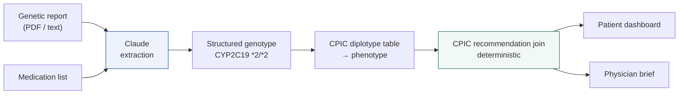

# Beacon

**Checks the medicines you already take against the genome you already have.**

Built for the Consumer Health Hackathon, London, 25–26 July 2026.

---

## The problem

Around a third of people carry a genetic variant that changes how a common drug
behaves in their body. Clopidogrel does not activate properly in a CYP2C19 poor
metaboliser. Codeine gives no pain relief to a CYP2D6 poor metaboliser.
Simvastatin carries a much higher myopathy risk with an SLCO1B1 poor-function
result.

This is not speculative. It is published, peer-reviewed, guideline-level
medicine — the Clinical Pharmacogenetics Implementation Consortium (CPIC) has
issued prescribing recommendations for hundreds of drug–gene pairs.

Almost none of it reaches the patient. Consumer genetic reports bury the
genotype in fifty pages of PDF, and a GP with eight minutes has neither the time
to read it nor a reason to expect it.

Beacon closes that gap.

## The architectural claim

> The language model does **extraction** and **translation**.
> A deterministic rules engine grounded in CPIC produces every clinical claim.

This inversion is the point of the project. Ask any health-AI demo "how do you
know the model didn't invent that?" and the answer is usually a shrug and a
disclaimer. Here, every recommendation shown to a user is a verbatim row from
CPIC's published dataset, carried through with its evidence grade, its clinical
indication, and a link to the source guideline. **The model does not decide
anything clinical** — it does not choose the recommendation, grade the evidence,
rank the findings, or judge severity. All of that is a table lookup.

The model does exactly two jobs:

**Extraction.** Reading a genotype out of whatever chaotic format a consumer lab
decided to use this quarter. This is genuinely hard and genuinely worth a model.
Its output is validated against the genes we hold tables for before it reaches
the engine, so an invented gene symbol is dropped rather than carried forward.

**Translation.** Restating CPIC's guidance in language the patient can use. The
source text is written for prescribers — *"significantly reduced clopidogrel
active metabolite formation; increased on-treatment platelet reactivity"* — and
a product whose entire premise is reaching the person taking the drug cannot
hand them that and call it done.

Three constraints keep the translation honest:

- It is **generated once and committed** (`src/data/plain-english.json`, 368
  entries), not written per request. So it can be read, reviewed and corrected
  by a human, and the same input always produces the same words.
- It is **never shown alone**. The verbatim CPIC recommendation sits directly
  beneath it, and carries the instruction.
- It is **forbidden from instructing**. The prompt bars it from telling the
  reader to do anything, from adding facts the source does not contain, and from
  softening or amplifying severity. It explains; the guideline directs.

If a translation is ever missing, the UI falls back to the source text — the
failure mode is clinical language, not silence or invention.



## Two artifacts, one pipeline

| | Patient dashboard | Physician brief |
|---|---|---|
| Route | `/report` | `/report/clinical` |
| Reader | The person taking the drugs | A clinician with eight minutes |
| Register | Plain language, severity-triaged cards | One page, A4, medical notation |
| Shared | Identical underlying findings — no divergent second source of truth | |

## Data provenance

Everything clinical comes from [CPIC](https://cpicpgx.org)'s public API
(`api.cpicpgx.org`), pulled at build time by `scripts/seed-cpic.mjs` and
committed to `src/data/cpic/`. The app makes no network call to CPIC at runtime,
so the demo is deterministic and works offline.

| Table | Rows |
|---|---|
| Prescribing recommendations | 2,115 |
| Diplotype → phenotype mappings | 27,381 |
| Drugs | 324 |
| Published guidelines | 29 |
| Genes | 15 |

Three details in that dataset shaped the engine:

- **CYP2D6 joins on activity score, not phenotype name.** Most genes match
  recommendations on a phenotype string like `Poor Metabolizer`; CYP2D6 uses a
  numeric activity score. Matching on phenotype alone silently drops every
  CYP2D6 recommendation — a third of the table, covering codeine and the
  antidepressants.
- **Two thirds of recommendations are multi-gene.** A recommendation is only
  applied when the patient has a call for *every* gene it depends on. Partial
  matches would assert guidance the data does not support.
- **CPIC ships its own severity triage** in the `ehrpriority` field, so even the
  red/amber/green banding is guideline-sourced rather than invented here.

## Running it

```bash
npm install
```

```bash
npm run dev
```

Re-pull the clinical dataset (only needed when CPIC publishes an update):

```bash
node scripts/seed-cpic.mjs
```

Verify the engine against the real dataset:

```bash
npx tsx scripts/verify-engine.ts
```

The verification script checks genotype resolution, brand-name handling,
multi-gene matching, and severity triage across all 2,115 recommendations —
including the two traps that break naive implementations: `"No reason to avoid…"`
must not read as high risk, and `"Avoid X… use Y at standard dose"` must not read
as routine.

## Safety and scope

Beacon is a **demonstration prototype**. It is not a medical device and not
medical advice, diagnosis or treatment.

All patient data in this repository is **synthetic**. No real genotype, report,
or person is represented anywhere in the codebase.

The product deliberately does not: chat, diagnose, infer disease risk, or
recommend anything CPIC has not already published. Its entire job is to carry
existing guideline knowledge the last mile to the person it concerns — and to
their doctor.
